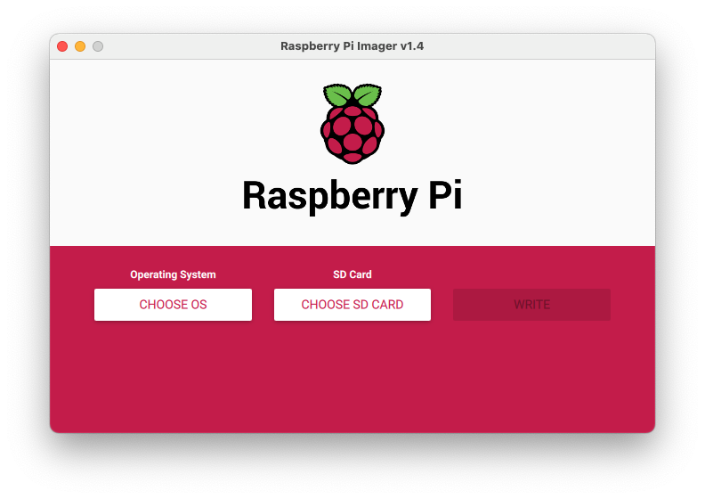
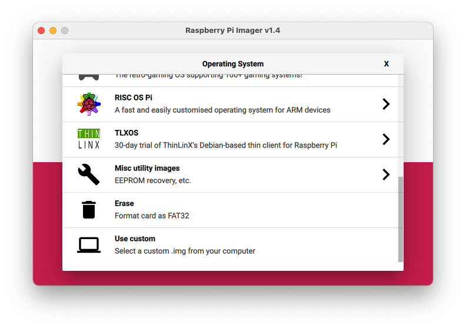
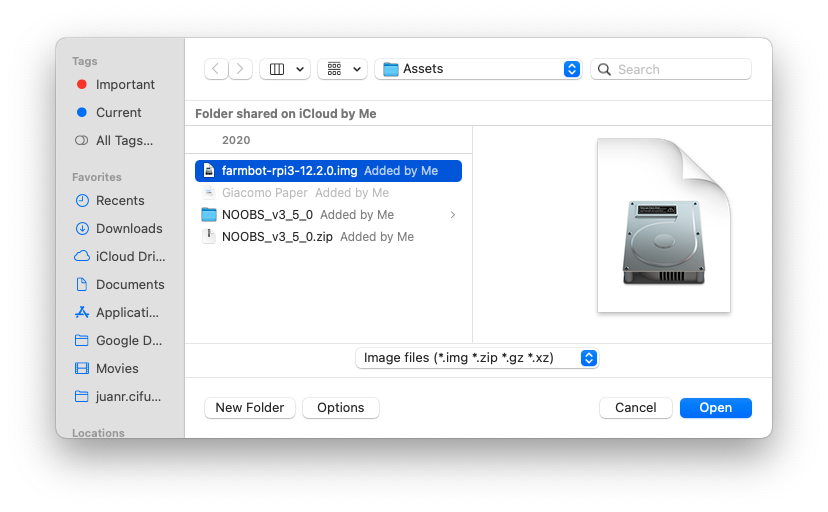

## Configuración FarmBot

En este manual se darán los pasos para utilizar el FarmBot con el software de fábrica. Para esto se requieren 3 pasos y varios assets que se listarán a continuación con su link de descarga:

Assets:
1. Raspberry Pi Imager ([LINK](https://www.raspberrypi.org/software/))
2. FarmBot OS para Raspberry Pi 3 ([LINK](https://my.farm.bot/os))
3. Memoria microSD para la instalación del sistema opetarivo en el Raspberry Pi
4. Raspberry Pi 3
5. Telefono Android o computador con Windows y Wi-Fi

Pasos:
1. Instalación de Farmbot OS en el Raspberry Pi 

Se abre el Raspberry Pi Imager y se debe presentar la interfaz a continuación:

Se selecciona la opción "CHOOSE OS", con lo cual se podrá seleccionar un sistema operativo para instalar. Ya que el Farmbot OS no es un sistema operativo estándar, se debe seleccional la opción "Use custom" que se encuentra al final de la lista

En este punto se debe navegar hasta el Farmbot OS para Rasperry Pi 3 que se descargó previamente, se selecciona y se da click en "Open"

Finalmente se selecciona la tarjeta microSD en donde se quiere instalar el sistema operativo y se da click en "WRITE" para iniciar con la instalación de este.

Por último, se debe conectar el Raspberry Pi al Farmbot para que al encenderlo por primera vez comience la configuración inicial. 

2. Configuración inicial

Para esta configuración se recomienda el uso de un dispositivo Android o un computador con Windows, ya que se hicieron pruebas con dispositivos Apple y no eran 100% compatibles. 

Al encender el Raspberry Pi luego de realizar la instalacion del Farmbot OS, luego de unos minutos deberá aparecer una red Wi-Fi nueva creada por el Raspberry Pi. Se procede a conectarse a esta y realizar los pasos de configuración como se va indicando. Debe tenerse en cuenta que se requiere una cuenta de Farmbot, la cual puede ser consultada en la cuenta de LastPass que se entregó al comienzo del semestre.

3. Instalación del Firmware adecuado en el Farmduino

Para la instalación del fimrware en el Farmduino, se debe tener comleta la configuración inicial del Farmbot OS. En este punto ya se tiene acceso a la WebApp de Farmbot, en la cual nos dirigiremos a la pestaña de configuración, luego a Firmware y se selecciona la opción que se requiera. Actualmente se está utilizando al versión 1.5, pero el cambio de versiones puede ser útil o necesario por lo que no estaá limitado a esta.